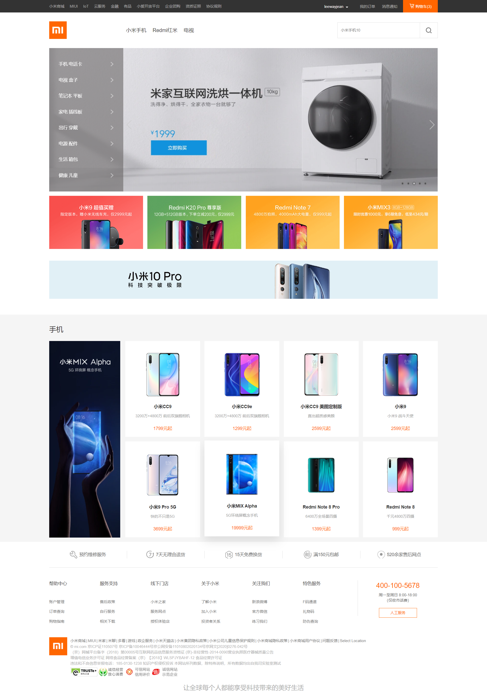
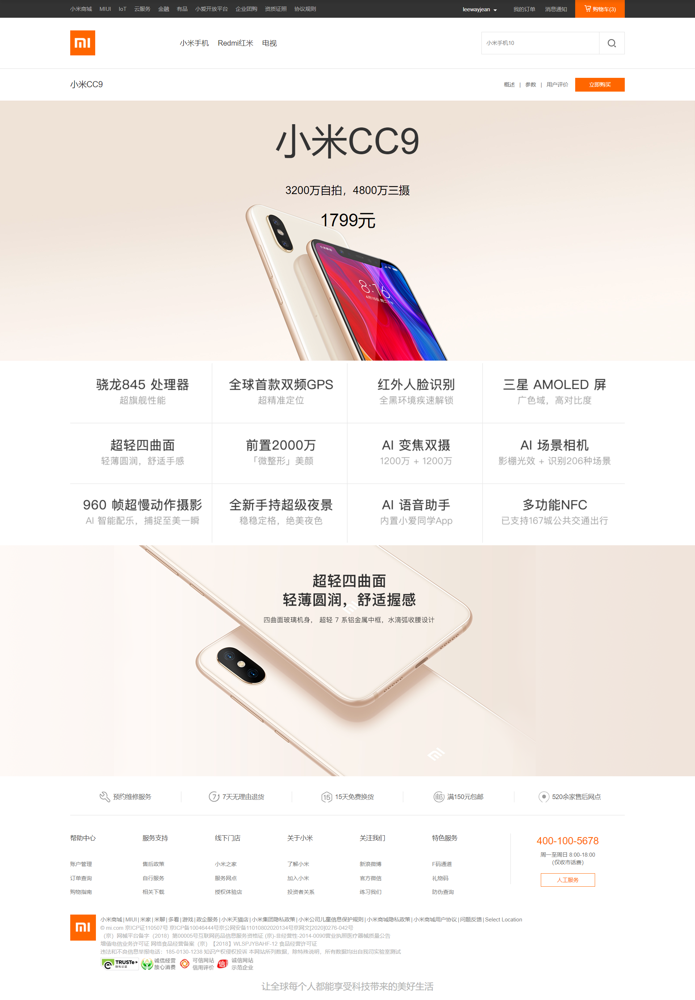
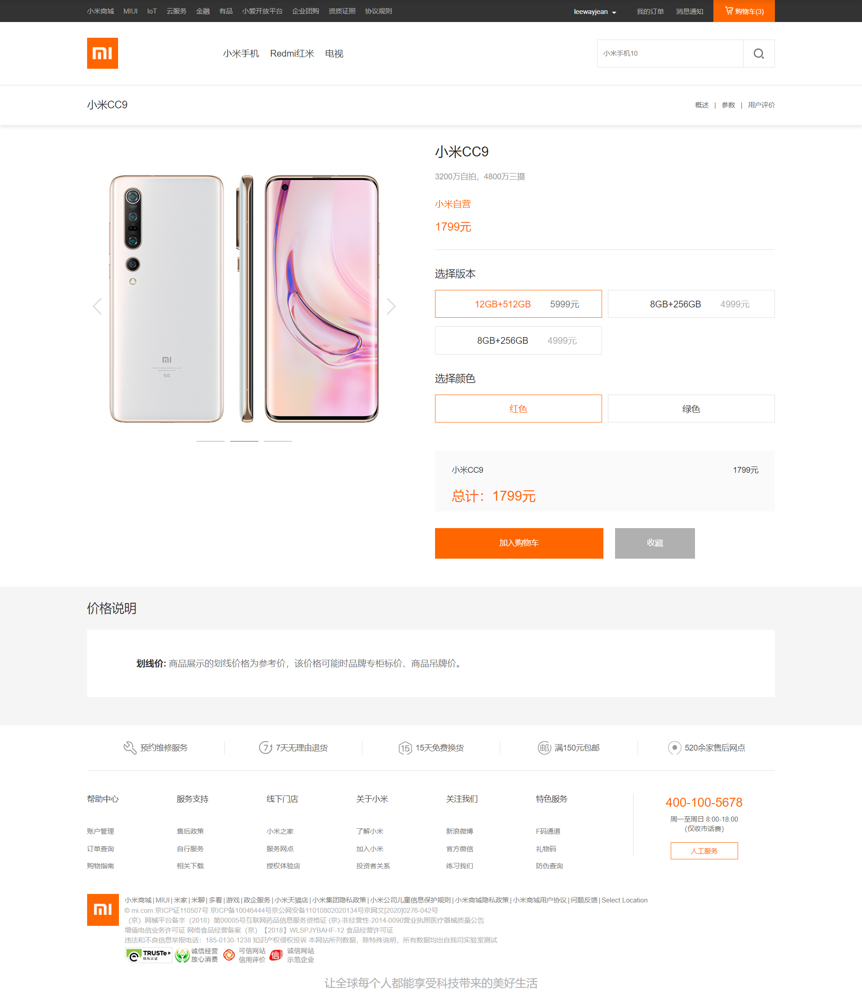
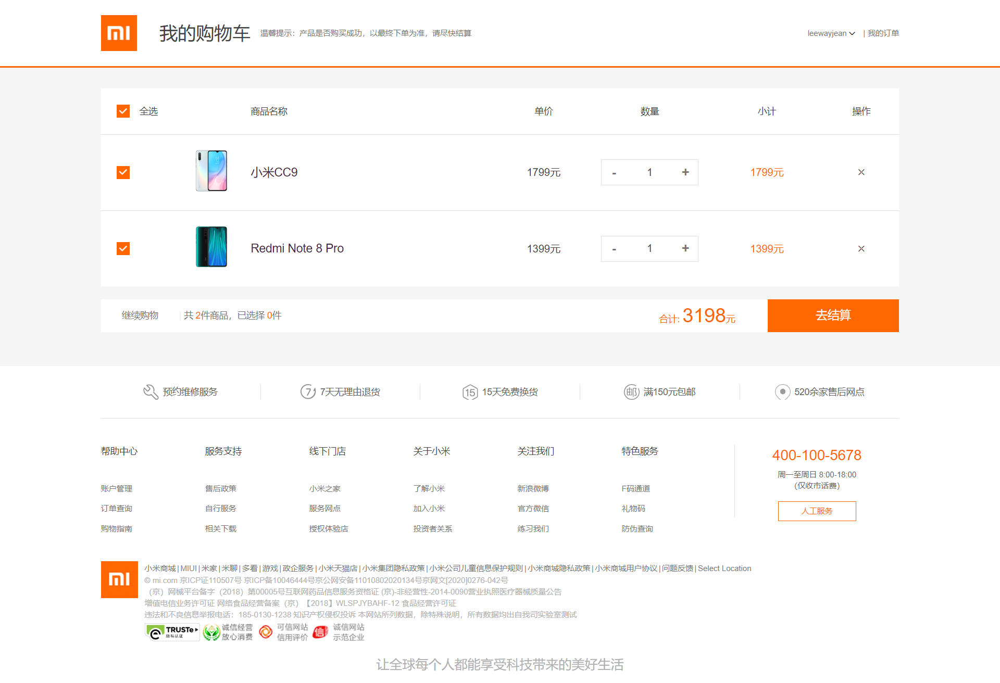
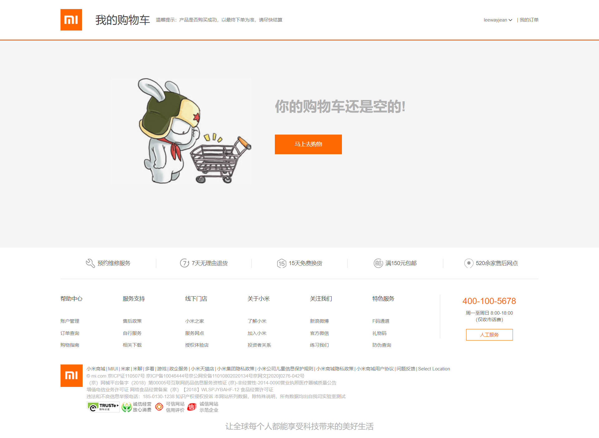
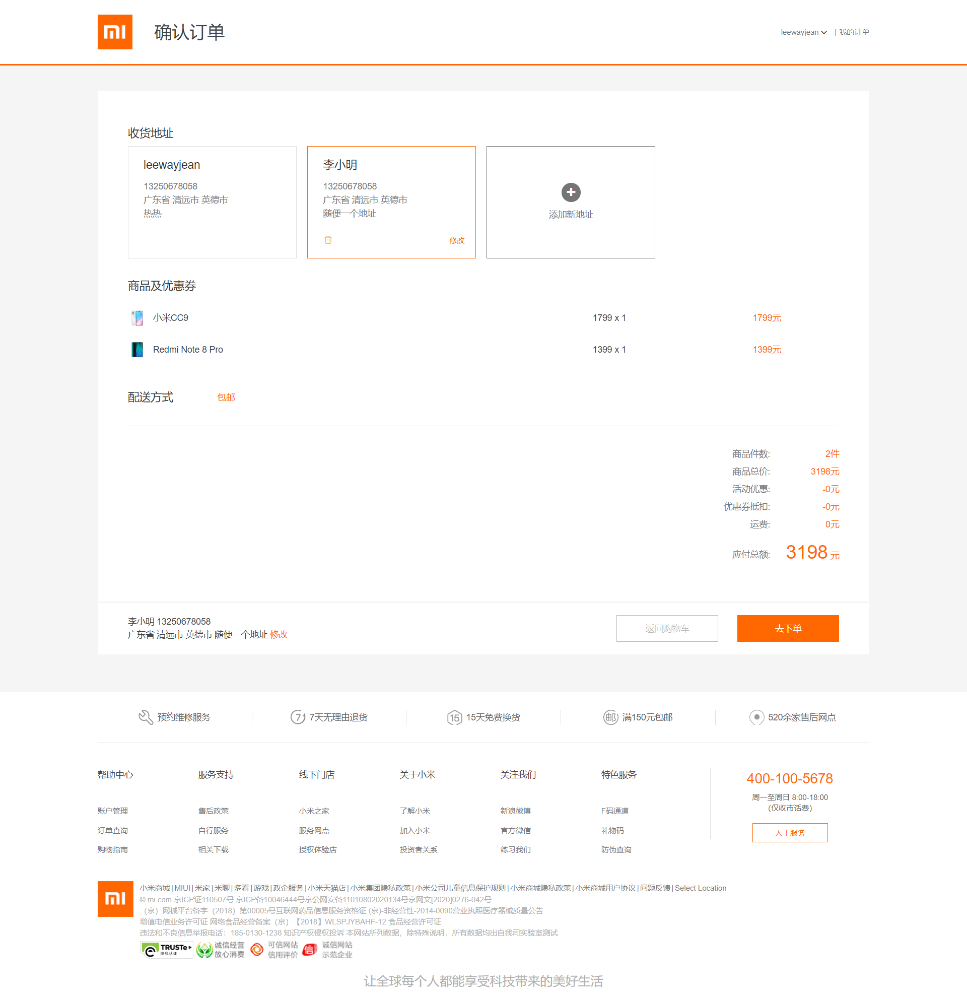

# ruok-mall
基于vueJS开发的高仿小米商城项目
## 技术栈

    vueJS + vue-router + vuex + webpack + axios + sass

## 项目介绍  
项目使用vue.js进行开发，目前已经完成基本的交互与页面。包括登录页面、商城首页、产品介绍、添加购物车、订单提交等。
## 业务功能实现
    * 登录
    * 商品列表展示
    * 产品站
    * 加购物车及购物车实现删除商品、添加商品
    * 收货地址选择、修改与删除
    * 提交订单
    * 订单列表展示
    * 支付。。。未完成
## 交互功能实现 （项目中的动画、过渡使用css3与vue提供的transition组件制作）
    * 首页轮播图、产品详情轮播图
    * 动态吸顶栏
    * 图片懒加载  
    * 页面加载进度条
    * 购物车、提交订单等页面loadding图
    * 基本的弹出框交互
## 测试账号
    由于暂时没有实现注册页面
    先提供一个测试账号：
    ```
    用户名：leewayjean
    密码：123456
    ```
## 项目截图 (部分) 
* 登录
    
* 首页                                     
  
* 产品站
      

* 商品详情
   
* 购物车   
  
* 购物车无商品 
  
 * 订单结算
   


    


## 项目启动

### 注意事项
项目启动前，请确保你安装了对应的环境，包括nodeJS环境。项目使用sass，因此确保项目启动前安装node-sass、sass-loader依赖。  

```
npm install   //安装依赖
```

### 编译、热更新
```
npm run serve   // 启动项目
```

### 编译、压缩
```
npm run build  // 打包压缩
```

### 运行测试
```
npm run test   //测试
```
